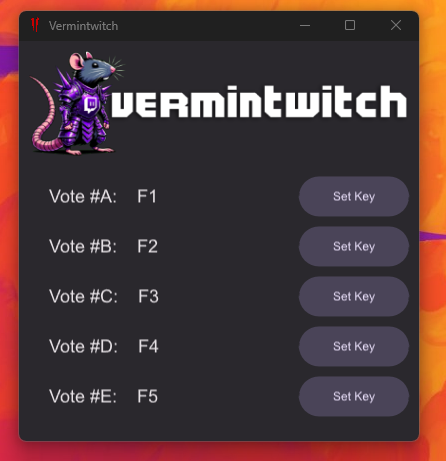

# Vermintwitch

A fake twitch backend for vermintide 2 that runs locally as a desktop app and lets you control your own votes.

## Usage

Run the .exe and set your hotkeys before trying to connect to twitch.

Go to the twitch tab in game and press connect, no need to enter a channel name.

That's it, press your hotkeys to vote.

## How it works

The app adds DNS entries to your windows hosts file, so when your computer goes to look up:

`api.twitch.tv` or `irc.twitch.tv`

it instead gets pointed back at itself, where vermintwitch is running a mock server for each.

Pressing your hotkeys will then send messages from the fake IRC server which the game interprets as twitch votes.

**The program does** ***NOT*** **interact with the game processes at all.** This is not any kind of hack. It happens
entirely at the network level and can safely be used on official servers without worrying about EAC. The idea got the
green light from Fatshark providing "I do not do anything malicious to the users computer" - which you can verify here -
or compile from source yourself if you wish.

## Cleaning up (manually)

The app will automatically clean the hosts file on close.

If you need to manually remove all files created on your system follow these steps:

### Removing hosts entries

1. Open Notepad as Administrator:

    - Click on the Start menu and type Notepad.
    - Right-click on the Notepad app and select Run as administrator.
    - If prompted by the User Account Control (UAC), click Yes to allow Notepad to run with administrative privileges.

2. Open the Hosts File in Notepad:

    - In Notepad, go to File > Open.
    - Navigate to C:\Windows\System32\drivers\etc. By default, Notepad shows only text files. To see the hosts file,
      change the file type to All Files (\*.\*) [bottom right].
    - Select the hosts file and click Open.

3. Edit the Hosts File:

    - Delete both full lines with "twitch" in the name.
    - Save the file.
    - If the file won't save, make sure you followed the instructions to run as admin.

4. Flush the DNS Cache (Optional):

    - To ensure your system immediately applies changes made to the hosts file, you might need to flush your DNS cache.
    - Open Command Prompt as an administrator (right-click on the Start menu, choose Windows Terminal (Admin) or Command
      Prompt (Admin)).
    - Type the command `ipconfig /flushdns` and press Enter.
    - Close the Command Prompt.

### Removing appdata

1. Navigate to AppData\Roaming (%APPDATA%)
2. Delete the Vermintwitch directory

### Removing trusted root certificate

1. Launch MMC
    - Open Run Dialog: Press Win + R on your keyboard to open the Run dialog.
    - Launch MMC: Type mmc in the Run dialog and press Enter. This opens the Microsoft Management Console.

2. Add the certificates snap-in
    - In MMC, go to File > Add/Remove Snap-in.
    - Select Certificates from the list of available snap-ins and click Add.
    - Choose Computer account, then click Next.
    - Select Local computer: (the computer this console is running on), then click Finish.
    - Click OK to close the Add or Remove Snap-ins dialog.

3. Find the vermintwitch certificate
    - In the MMC, expand the Certificates (Local Computer) tree.
    - Navigate to Trusted Root Certification Authorities > Certificates.
    - Scroll down to locate the certificate named "Vermintwitch" issued to api.twitch.tv
    - Right click and select delete